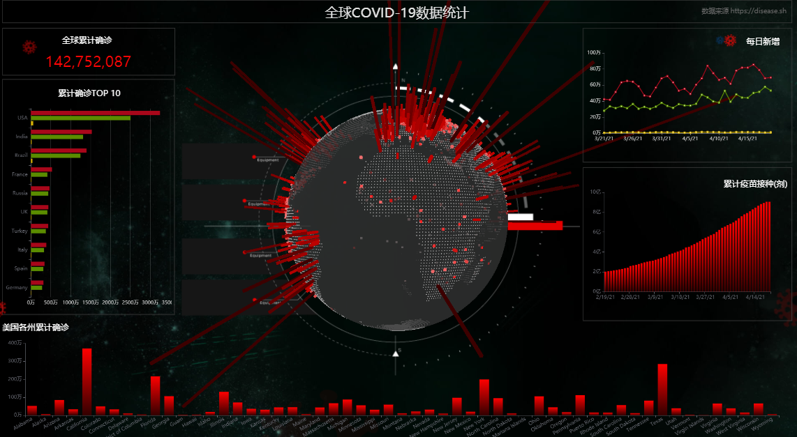

  

Mojito是一个可视化数据分析、数据展示和轻业务开发的平台

## ✨ 特性

- 点选、拖拽、缩放的可视化操作
- 群组/解散、撤销/重做、图层显示/隐藏、锁定/解锁、对齐和排序
- 支持使用React和Vue3自定义组件
- 组件样式可视化配置
- 组件间通讯、页面下钻、动态脚本...
- 跨终端事件同步、跨大屏联动交互

  

## 📦 组件开发 Develop

## 📄 文档 Document
[http://mojito.drinkjs.com/docs](http://mojito.drinkjs.com/docs)

## 🚀 演示 Demo
[http://mojito.drinkjs.com](http://mojito.drinkjs.com)