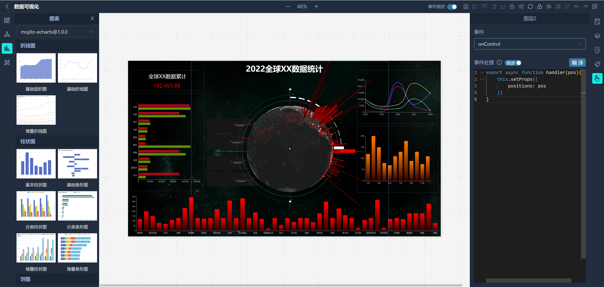
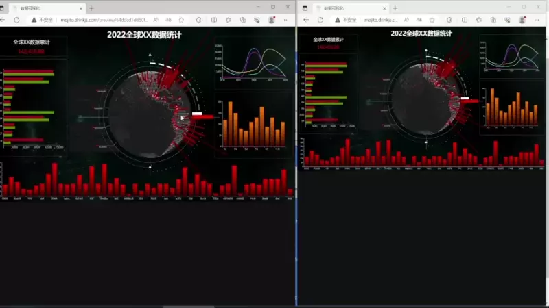
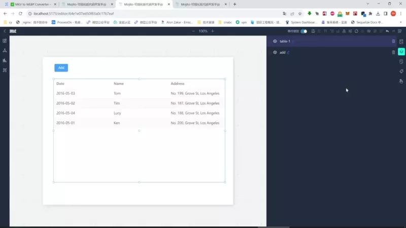

  

Mojito是一个低代码，可视化，可扩展开发平台

##  🔥特性

- 点选、拖拽、缩放的可视化操作
- 群组/解散、撤销/重做、图层显示/隐藏、锁定/解锁、对齐和排序
- 支持使用React和Vue3自定义组件，样式隔离
- 组件样式可视化配置
- 组件间通讯、页面下钻、动态脚本...

  

## 👆🏼 事件同步

  

## ✨ 组件通讯

  

## 📄 后端代码

[https://github.com/drinkjs/mojito-server](https://github.com/drinkjs/mojito-server)

[https://gitee.com/drinkjs/mojito-server](https://gitee.com/drinkjs/mojito-server)

## 📦 组件开发 Develop
支持使用React或Vue及相关生态开发自定义组件库，组件和样式相互隔离，互不影响，组件间可以通过消息事件进行通信

[组件库开发指南](http://mojito.drinkjs.com/document/)

## 📄 文档 Document
[http://mojito.drinkjs.com/document](http://mojito.drinkjs.com/document)

## 🚀 演示 Demo
[http://mojito.drinkjs.com](http://mojito.drinkjs.com)
