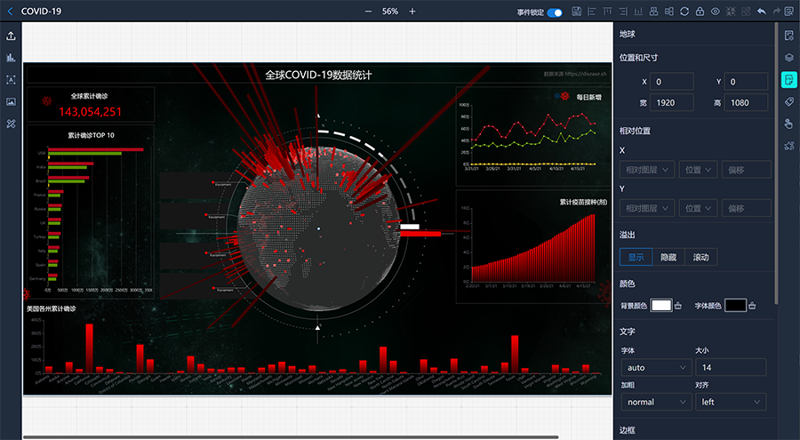

<p align="center">
  
</p>
<p align="center">Mojito是一个可视化数据分析、数据展示和轻业务开发的平台</p>

## ✨ 特性

- 点选、拖拽、缩放的可视化操作
- 群组/解散、撤销/重做、图层显示/隐藏、锁定/解锁、对齐和排序
- 支持使用React/Vue开发上传自定义组件
- 支持通过HTTP数据源接入，轮询
- 组件样式可视化配置
- 组件动画可视化配置
- 组件间通讯、页面下钻、动态脚本...
- 跨终端事件同步、跨大屏联动交互
- 100%开源，支持私有化部署
<p>
  
</p>

## ⚙️ 安装 Install
### 环境要求
- Node.js >= 14.0.0
- MongoDB >= 4.2.12

```bash
git clone https://gitee.com/drinkjs/mojito.git
```
### 启动后端
打开server/config/index.ts修改MongoDB相关连接信息
```bash
cd server
npm install --registry=https://registry.npmmirror.com/
npm run dev
```

### 启动前端
```bash
cd client
npm install --registry=https://registry.npmmirror.com/
npm start
```

## 📦 组件开发 Develop
* [**mojito-compack**](https://gitee.com/drinkjs/mojito-compack): 使用React 自定义Mojito组件.

* [**mojito-compack-vue**](https://gitee.com/drinkjs/mojito-compack-vue): 使用Vue2自定义Mojito组件.

* [**mojito-compack-vue3**](https://gitee.com/drinkjs/mojito-compack-vue3): 使用Vue3自定义Mojito组件.

## 📄 文档 Document
[http://mojito.drinkjs.com/docs](http://mojito.drinkjs.com/docs)

## 🚀 演示 Demo
[http://mojito.drinkjs.com](http://mojito.drinkjs.com)