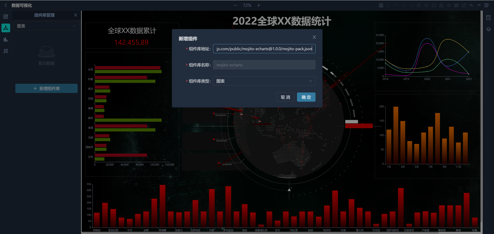

<p align="center">
  
</p>
<p align="center">Mojito是一个低代码，可视化，可扩展开发平台</p>

##  🔥特性

- 点选、拖拽、缩放的可视化操作
- 群组/解散、撤销/重做、图层显示/隐藏、锁定/解锁、对齐和排序
- 支持使用React和Vue3自定义组件库
- 支持组件间样式隔离
- 组件样式可视化配置
- 组件间通讯、事件同步、动态脚本...

<p>
  
</p>

## 👆🏼 事件同步
<p align="center">
  
</p>

## ✨ 组件通讯
<p align="center">
  
</p>

## 🧪 测试组件库
### Antd

[http://mojito.drinkjs.com/public/mojito-antd@1.0.0/mojito-pack.json](http://mojito.drinkjs.com/public/mojito-antd@1.0.0/mojito-pack.json)

### Echarts

[http://mojito.drinkjs.com/public/mojito-echarts@1.0.0/mojito-pack.json](http://mojito.drinkjs.com/public/mojito-echarts@1.0.0/mojito-pack.json)

### Element
[http://mojito.drinkjs.com/public/mojito-element@1.0.0/mojito-pack.json](http://mojito.drinkjs.com/public/mojito-element@1.0.0/mojito-pack.json)

## 🗄️ 后端代码

[https://github.com/drinkjs/mojito-server](https://github.com/drinkjs/mojito-server)

[https://gitee.com/drinkjs/mojito-server](https://gitee.com/drinkjs/mojito-server)

## 📦 组件开发

```bash
npx create-mojito-pack
```

定义组件

```js
<template>
	<div>{{ text }}</div>
</template>

<script lang="ts">
import { CreatePack } from "@drinkjs/mojito-vue-pack";
import { defineComponent } from "vue";

// 常规vue组件定义
const Text = defineComponent({
	props: {
		text: String,
	},
});

export default Text;

// 定义Mojito组件
export const PackText = CreatePack(Text, {
	name: "文本", // 组件的名称
	category: "基础组件", // 组件分类
    // 组件props定义
	props: {
		text: {  // 对应vue中props中的定义
			name: "文字", // 属性名称
			type: "string", // 属性类型
			default: "这里显示文本...", // 默认值
		},
        ... // 更多属性
	},
});
</script>
```

编译组件库

```bash
mojito build
```

平台添加组件库



## 🔩 系统组件库

[https://github.com/drinkjs/mojito-pack](https://github.com/drinkjs/mojito-pack)


## 📄 文档
[http://mojito.drinkjs.com/document](http://mojito.drinkjs.com/document)

##  👓 演示
[http://mojito.drinkjs.com](http://mojito.drinkjs.com)


## 🚀 未来

- 更好的开发体验
- 3D 编辑器
- 动画编辑器
- 组件市场
- 原形图生成可编辑页面
- ...

## 技术交流

