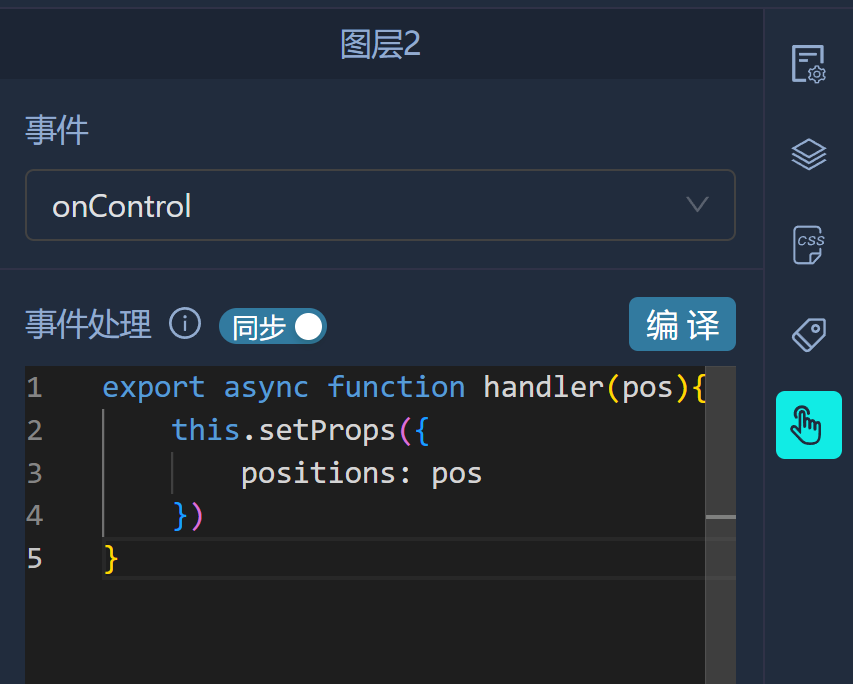

# 事件处理

配置组件事件回调函数

### 系统事件

- 组件加载：()=>void 组件加载完成时回调
- 组件卸载：()=>void 组件卸载时回调
- 接收消息：(...args, target)=>void 收到其他组件发送的消息时回调

### 回调函数

### this

每个回调函数都会自动注入this，this包括以下属性
- getProps: (key?:string) => any 返回当前配置的props
- setProps: (props: Record<string, any>) => void 配置当前组件的props
- navigate: (to: string) => void 路由跳转
- sendMessage: (layerNames: string | string[], ...args: any[]) => void 向指定的图层名发送消息

箭头函数没有this，所以如果要使用this请使用function定义回调函数

### 事件同步

开启事件同步后，当前组件事件响应会同步到远端的同一个页面下相同组件

### 组件间通讯

组件间通讯主要通过sendMessage方法实现，接收消息的图层需要监听【接收消息】事件
